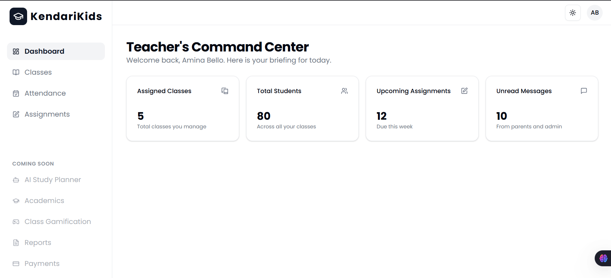

# KendariKids - Modern School Management System MVP

[](https://kendari-kids-mvp-project.vercel.app/)
[](https://github.com/HephtronCode/kendariKids-MVP-Project/actions)
[](https://opensource.org/licenses/MIT)

The culmination of an epic development journey, **KendariKids** is the Minimum Viable Product for a modern, responsive, and user-friendly school management system designed for schools in Africa, from nursery through secondary levels. 

## 🚀 Live Demo

**Experience the deployed application live on Vercel:**

### **[https://kendari-kids-mvp-project.vercel.app/](https://kendari-kids-mvp-project.vercel.app/)**



---

## ✨ Features

-   **Role-Based Access Control:** Secure, distinct dashboards and permissions for Teachers and Parents.
-   **JWT Authentication:** Robust and secure user authentication using JSON Web Tokens, complete with session persistence.
-   **Dynamic Dashboards:** Tailored dashboards for each role, providing relevant, at-a-glance information.
-   **Class Management:** An intuitive interface for teachers to create and manage their classes.
-   **Attendance Tracking:** A real-time attendance system allowing teachers to mark student presence for any given day.
-   **Assignment Management:** A full CRUD module for teachers to create and list assignments for their classes.
-   **Fully Responsive UI:** A mobile-first design built with Tailwind CSS that looks beautiful on all devices, featuring a slide-out drawer for mobile navigation.
-   **Light & Dark Mode:** A theme switcher for user comfort and preference, with the user's choice saved locally.
-   **CI/CD Pipeline:** An automated Continuous Integration pipeline using GitHub Actions to lint and build the application on every push, ensuring code quality.

---

## 🛠️ Tech Stack & Architecture

This project is a full-stack MERN application built with a modern, cutting-edge toolchain.

#### Frontend

-   **Framework:** React 18 (bootstrapped with Vite for a fast development experience)
-   **Styling:** Tailwind CSS (v4 Alpha)
-   **Component Library:** shadcn/ui (for beautiful, accessible, and unstyled components)
-   **Package Manager:** pnpm
-   **Routing:** React Router v6
-   **API Communication:** Axios
-   **Deployment:** Vercel

#### Backend

-   **Runtime:** Node.js
-   **Framework:** Express.js
-   **Database:** MongoDB (hosted on MongoDB Atlas)
-   **ODM (Object Data Modeling):** Mongoose
-   **Authentication:** JSON Web Tokens (JWT) & bcrypt.js for password hashing
-   **Deployment:** Render

---

## 🚀 Getting Started (Local Development)

Follow these instructions to get a copy of the project up and running on your local machine.

### Prerequisites

-   [Node.js](https://nodejs.org/) (v18.x or newer recommended)
-   [pnpm](https://pnpm.io/installation) package manager (`npm install -g pnpm`)
-   A free [MongoDB Atlas](https://www.mongodb.com/cloud/atlas/register) account.

### Installation

1.  **Clone the Repository**
    ```bash
    git clone https://github.com/HephtronCode/kendariKids-MVP-Project.git
    cd kendariKids-MVP-Project
    ```

2.  **Setup the Backend Server**
    -   Navigate to the server directory: `cd server`
    -   Install dependencies: `pnpm install`
    -   Create a `.env` file in the `/server` directory and add the following variables:
        ```env
        PORT=5000
        MONGO_URI=your_mongodb_atlas_connection_string
        JWT_SECRET=your_super_secret_jwt_key
        ```
    -   Start the development server: `pnpm run dev`

3.  **Setup the Frontend Client**
    -   Navigate to the client directory: `cd client`
    -   Install dependencies: `pnpm install`
    -   The client is configured to connect to `http://localhost:5000`. Start the client server:
        ```bash
        pnpm run dev
        ```
        The application will be running on `http://localhost:5173`.

---
