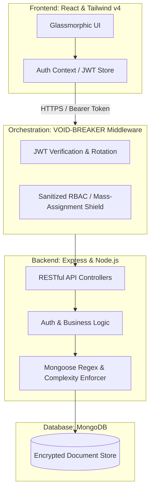

# KendariKids - Modern School Management System MVP

[](https://github.com/HephtronCode/kendariKids-MVP-Project/actions)
[](https://opensource.org/licenses/MIT)

The culmination of an epic development journey, **KendariKids** is the Minimum Viable Product for a modern, responsive, and user-friendly school management system designed for schools in Africa, from nursery through secondary levels.

---

## 🛡️ Security Architecture (VOID-BREAKER Protocol)

The project has undergone rigorous security hardening under the **VOID-BREAKER** tactical mission, transforming the MVP into a **Sovereign-Apex** secured application.

### **System Architecture Diagram**


```mermaid
graph TD
    subgraph Client_Layer [Frontend: React & Tailwind v4]
        UI[Glassmorphic UI] --> Auth_Provider[Auth Context / JWT Store]
    end

    subgraph Security_Gate [Orchestration: VOID-BREAKER Middleware]
        Protect[JWT Verification & Rotation]
        RBAC[Sanitized RBAC / Mass-Assignment Shield]
    end

    subgraph Core_Layer [Backend: Express & Node.js]
        API[RESTful API Controllers] --> Services[Auth & Business Logic]
        Services --> Validation[Mongoose Regex & Complexity Enforcer]
    end

    subgraph Data_Layer [Database: MongoDB]
        DB[(Encrypted Document Store)]
    end

    Auth_Provider -- "HTTPS / Bearer Token" --> Security_Gate
    Security_Gate --> API
    Validation --> DB
```

### **Hardening Highlights**
- **JWT Secret Rotation:** Automated rotation to high-entropy secrets with a strict **24-hour expiration** window.
- **Role Mass-Assignment Protection:** Backend-enforced whitelisting of public roles (`teacher`, `parent`) to prevent unauthorized privilege escalation.
- **Advanced Password Complexity:** Mongoose-level regex enforcement requiring uppercase, lowercase, numbers, and a minimum of 8 characters.
- **Information Leakage Prevention:** Sanitized authorization error messages that do not disclose internal role structures.

---

## ✨ Features (Phase 1 to Phase 3)

### Core Systems
- **Role-Based Access Control:** Secure, distinct dashboards and permissions for Teachers and Parents.
- **JWT Authentication:** Robust and secure user authentication using JSON Web Tokens.
- **Dynamic Dashboards:** Tailored dashboards ("Mission Control") for each role, providing relevant, at-a-glance information.

### Academic & Administrative Modules
- **Class Management:** An intuitive interface for teachers to create and manage their classes.
- **Attendance Tracking:** A real-time attendance system to mark student presence, absence, or tardiness.
- **Assignment Management:** A full CRUD module for teachers to create and list assignments.
- **Gradebooks (New in Phase 3):** A comprehensive module allowing teachers to log continuous assessment scores, calculate final grades dynamically, and publish them to parent dashboards.
- **Class Timetable (New in Phase 3):** An academic scheduling tool for teachers to create weekly routines, mapping subjects, times, and rooms to days of the week.

### UI/UX Innovations
- **Floating Glass Architecture (New):** A highly modern layout featuring detached, floating navigation elements and glassmorphic (`backdrop-blur`) panels.
- **Premium African-Inspired Color Palette:** Implemented a custom "Sunset Savannah & Deep Ocean Slate" OKLCH design token system, moving away from generic UI templates.
- **Micro-Animations:** Extensively retrofitted with `hover-lift` and `hover-glow` smooth interactions to increase responsiveness and user delight.
- **Fully Responsive UI:** Mobile-first design built with Tailwind CSS v4, looking beautiful on all devices via a slide-out drawer navigation.

---

## 🛠️ Tech Stack & Architecture

This project is a full-stack MERN application built with a modern, cutting-edge toolchain. The project recently completed a **Cloud Decoupling**, ensuring it runs purely on localized `.env` variables and is not tethered to legacy cloud provider URLs.

#### Frontend
- **Framework:** React 18 (bootstrapped with Vite)
- **Styling:** Tailwind CSS (v4 Alpha) with custom OKLCH color palettes and Native CSS variables.
- **Component Library:** Custom glassmorphic implementation over shadcn/ui.
- **Routing:** React Router v6
- **API Communication:** Axios (mapped dynamically via `VITE_API_URL`)

#### Backend
- **Runtime:** Node.js
- **Framework:** Express.js
- **Database:** MongoDB
- **ODM:** Mongoose
- **Authentication:** JSON Web Tokens (JWT) & bcrypt.js

---

## 🚀 Getting Started (Local Development)

Follow these instructions to get a copy of the project up and running on your local machine.

### Prerequisites

- [Node.js](https://nodejs.org/) (v18.x or newer recommended)
- [pnpm](https://pnpm.io/installation) package manager (`npm install -g pnpm`)
- A local MongoDB instance or a free [MongoDB Atlas](https://www.mongodb.com/cloud/atlas/register) connection string.

### Installation

1.  **Clone the Repository**

    ```bash
    git clone https://github.com/HephtronCode/kendariKids-MVP-Project.git
    cd kendariKids-MVP-Project
    ```

2.  **Setup the Backend Server**

    - Navigate to the server directory: `cd server`
    - Install dependencies: `pnpm install`
    - Create a `.env` file in the `/server` directory and add the following variables:
      ```env
      PORT=5000
      MONGO_URI=your_mongodb_connection_string
      JWT_SECRET=your_super_secret_jwt_key
      ```
    - Start the development server: `pnpm run dev`

3.  **Setup the Frontend Client**
    - Navigate to the client directory: `cd client`
    - Install dependencies: `pnpm install`
    - Create a `.env` file in the `/client` directory and add:
      ```env
      VITE_API_URL=http://localhost:5000/api
      ```
    - Start the client server:
      ```bash
      pnpm run dev
      ```
      The application will be running on `http://localhost:5173`.

---

## 📅 Roadmap (Upcoming Phases)

- **Phase 4:** AI Study Planner (LLM integration for personalized study habits)
- **Phase 5:** Class Gamification (Badges/Points for achievements)
- **Phase 6:** Reports Generation (PDF exports)
- **Phase 7:** Payments Module (School fee processing)

---

## 🤝 Contributing
Built meticulously under the P.H.A.N.T.O.M.-W.E.B. protocol. Contributions, issues, and feature requests are welcome!

## 📝 License
This project is licensed under the MIT License.
